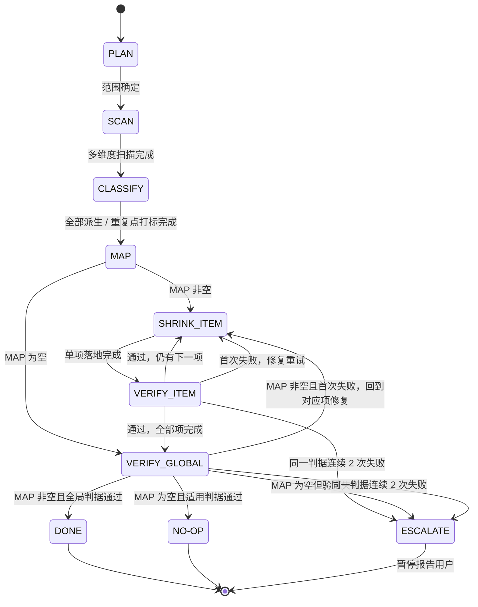

# context-shrink — 上下文缩小

## Outcome

在用户指定的仓库子目录内完成一组可验证、保持行为不变的源码重组，让维护者理解更少的数据源、派生、中转、重复和抽象。

衡量标尺是心智压缩比：读懂代码前后需要在脑中回答的问题数之比。行数或文件数减少只是副产物；如果改后需要跨更多位置追踪数据，即使代码更短也不算成功。

合法终态只有三种：

- `DONE`：所有 MAP 项及适用的全局验证通过。
- `NO-OP`：扫描后没有安全且有价值的缩小项，工作区保持不变，并完成适用验证。
- `ESCALATE`：命中停止条件，明确报告已完成、未完成、根因和可恢复的下一步。

## Use when

- 用户明确要求对一个仓库子目录缩小上下文、减少派生、消除重复、减少透传或中转。
- 用户希望优先复用项目已有 helper、组件、框架或依赖，删除自实现样板。
- 用户要清理双源 fallback、重复缓存、退化 DTO、prop drilling 或只使用一次的投机性抽象。
- 改动预计跨多个位置，需要先形成映射、逐项落地并验证，而不是直接做一次局部改写。
- 用户显式调用 `$context-shrink <仓库内目录>`。

## Do not use when

- 用户只要只读审查、问题清单、性能优化或 memoization 建议。
- 用户要重新设计类型系统、模块架构、业务规则、API、状态模型或 UI 视觉。
- 请求只是一个明确、局部、无需系统扫描的小修。
- 用户经一次询问后仍拒绝或无法提供仓库内目录。
- 目标天然要求同时保留新旧两套实现，或必须改变外部契约才能成立。

## Inputs

- 必需：一个存在于当前仓库内的目录路径。没有路径时只询问一次，不默认扫描整个仓库。
- 可选：明确的保护边界、排除文件、已知风险、目标行为、基线结果和项目验证命令。
- 默认范围：建议不超过 30 个文件或 5000 行；超过时先重新估算并建议拆分。
- 默认策略：保持行为与外部契约不变；不新增依赖；只改 MAP 覆盖的范围；使用项目已经声明的包管理器和验证命令。

## Preconditions

1. 解析当前仓库根目录和用户给出的目标目录。路径必须存在、位于仓库内，且不能通过符号链接逃逸到仓库外。
2. 检查 `git status --short`（若适用）并保留用户已有改动。读取目标范围适用的 `AGENTS.md`、`CLAUDE.md`、README、设计说明和项目脚本。
3. 建立保护清单：
   - API 入参出参、props、emits、slots 和跨组件事件名；
   - 用户可见行为、文案语义和 UI 视觉；
   - 类型约束和既有模块边界；
   - store、父子应用、身份切换、缓存生命周期等状态边界；
   - 用户明确排除的路径和已有改动。
4. 记录基线：

   | 指标 | 基线 |
   | --- | --- |
   | 文件总数与总行数 |  |
   | 单文件最大行数 |  |
   | 派生、重复、中转和 fallback 命中数 |  |
   | 类型检查、测试、lint、构建状态 |  |
   | 关键行为或视觉冒烟状态 |  |

5. 确定 DONE 必需的验证集合。若任一必需命令在基线失败，只有在能可靠定位为范围外既有失败、且受影响目标有独立通过判据时才可继续；否则在修改前停止并报告。

## Workflow

严格按 `PLAN → SCAN → CLASSIFY → MAP → SHRINK → VERIFY` 推进。不得在 MAP 完成前修改源码，也不得在单项验证失败时跳到下一项。

### State machine



### 1. PLAN

完成全部前置检查，输出范围、保护清单、基线和可用验证命令。范围没有确定前，不派发扫描、不读取整个仓库、不修改文件。

### 2. SCAN

覆盖五个独立维度。宿主有并行能力且任务规模值得时并行扫描；并行槽位不足时分批或顺序完成，不能因缺少特定 agent 工具而跳过维度。

| 维度 | 关注信号 | 常见动作 |
| --- | --- | --- |
| 数据派生 | `ref`、`computed`、getter、DTO、双源 fallback、镜像状态 | KEEP / REMOVE / COLLAPSE / ENCAPSULATE / UNIFY / HOIST |
| 重复样式 | 相同布局、间距、颜色或项目已有 utility 未复用 | UNIFY-STYLE / REPLACE |
| 现成能力 | 项目已采用的 helper、组件、框架或依赖能够替代自实现 | REPLACE |
| 中转层 | props 透传、改名包装、同名字段搬运、重新装罐 | REMOVE / COLLAPSE / HOIST |
| 投机性抽象 | 只被一处使用的通用 helper、composable、类型或配置 | INLINE / REMOVE |

每个命中点保持只读，记录统一字段：

| # | 位置 | 当前形态 | 可缩小理由 | 建议动作 |
| --- | --- | --- | --- | --- |

汇总时去重，并标明必须一起处理的跨维度联动。SCAN 只是输入，不能作为完成结果。

### 3. CLASSIFY

对全部命中点逐条分类。T1 和 T2 默认保留；T3 至 T7 只有在行为不变且能满足验证时才进入 MAP。

| 类型 | 标签 | 识别信号 | 处理动作 |
| --- | --- | --- | --- |
| T1 | 事实来源 | API 返回 / 用户输入 / 外部 SDK；无上游 | KEEP |
| T2 | 合法派生器 | 纯函数 / computed，单源派生，无副作用 | KEEP |
| T3 | 退化中间层 | DTO 字段都是源对象的搬运或一次派生；删了之后调用方调一个工具函数就行 | REMOVE |
| T4 | 双源 fallback | `a?.x \|\| b.x` 或 `a?.x ?? b.x` | COLLAPSE 到单源 |
| T5 | 重复缓存 | computed 之上再用 ref 镜像 + watch 同步 | ENCAPSULATE 共享 |
| T6 | 非对称分支 | 同名函数行为不一致 | UNIFY |
| T7 | Prop drilling 派生 | 派生穿 3+ 层 props | HOIST 或下沉 |

数据流之外使用这些窄动作：

| 动作 | 含义 |
| --- | --- |
| REPLACE | 用项目已有能力替代自实现 |
| INLINE | 将单次使用的投机性抽象内联回消费点 |
| MERGE | 合并同构且共同变化的实现 |
| SPLIT | 按真实变化轴拆分大文件；单文件至少 300 行且承担至少两个关注点时作为候选 |
| UNIFY-STYLE | 用项目已有 utility、mixin 或 token 收敛重复样式 |

### 4. MAP

修改前固化完整映射：

| # | 维度 | 位置 | 当前形态 | 分类 / 动作 | 目标形态 | 完工判据 | 依赖 | 风险 / 回退信号 |
| --- | --- | --- | --- | --- | --- | --- | --- | --- |

按依赖与风险排序：

1. 无依赖、低风险的 dead code、INLINE 和已有 utility 替换。
2. 单源整合与 T4 COLLAPSE。
3. T3 中间层删除及其调用方收敛。
4. 必要的 SPLIT、MERGE 或 ENCAPSULATE。

每项预定义失败信号。类型失败检查 import 与暴露；测试失败检查行为契约；视觉失败修复派生或复用方式；改动越出 MAP 时停止越界部分。

若全部命中都是 KEEP，或没有安全且有价值的候选，MAP 为空；不制造改动，进入适用的全局验证并报告成功 NO-OP。

若前一 MAP 项已自然消解后一项的根因，不删除后一项；将其标记为 `resolved by MAP #N`，重新验证原完工判据后再计为完成。

### 5. SHRINK

按 MAP 顺序逐项执行：

```text
SHRINK_ITEM(i)
  1. 只落地 MAP[i] 的目标形态，并同步删除被替代的旧实现
  2. 立即执行 VERIFY_ITEM(i)
  3. 通过后进入下一项
  4. 失败后仅修复该项并重试
  5. 同一判据连续失败两次后 ESCALATE
```

落地时遵循以下决策顺序：

1. 复用项目已有能力。
2. 复用当前框架、组件和已安装依赖的能力。
3. 复用边界清晰的现有 helper 或 composable。
4. 做最窄的本地常量映射、纯函数、computed 或小范围提炼。
5. 只有获得必要授权且现有能力不足时，才考虑新依赖或更大抽象。

落地中发现的 MAP 外事项只记入补充清单，不顺手修改。让派生靠近消费点，确保文案、颜色、状态、配置、映射和派生值各有一个清晰归属，不用新的中转层置换旧的中转层。

### 6. VERIFY

所有 MAP 项通过 VERIFY_ITEM 后执行全局验证。失败项回到对应的 SHRINK_ITEM；不得缩小 MAP、删掉失败项或把未运行检查标成通过来制造 DONE。

## Stop conditions

- 同一个 VERIFY_ITEM 或 VERIFY_GLOBAL 判据连续失败两次。
- MAP 为空，但任一适用的 VERIFY_GLOBAL 判据失败。
- 某个 MAP 项必须触碰保护清单、用户排除路径或未授权的仓库范围。
- 用户主动停止、改变目标或撤回修改授权。
- 实际命中量与 PLAN 严重不符，继续会超出约定范围。
- 工作区已有改动无法与本轮安全区分，或发现疑似密钥、私密数据和覆盖风险。
- 缺少关键验证能力，无法证明行为或外部契约保持不变。
- 完成必须安装依赖、访问网络或执行其他未授权副作用。

停止时进入 ESCALATE：报告已完成项、未完成项、失败判据、根因、当前工作区状态，以及继续、缩小范围或由用户决定回退的选项。不得静默退出、伪造 DONE 或擅自回退用户工作。

## Safety

- 不改变业务规则、用户可见行为、UI 视觉、API 参数、props、emits、slots 或状态边界。
- 不扫描或修改用户未指定的仓库范围，不跟随逃逸范围的符号链接。
- 不做 MAP 外改动，不把范围外发现升级成当前任务。
- 不为了减少行数新增不需要的依赖、通用 helper、中转变量或过宽返回对象。
- 不把真实业务规则塞进语义模糊的通用 helper。
- 不让新旧实现长期并存；替代成立时同步删除旧分支、旧状态、无用样式和包装层。
- 不覆盖或清理无法证明属于本轮的用户改动。
- 不修改 Git 历史、提交、推送、安装工具或访问外部系统，除非用户在当前任务中另行明确授权。
- 不把代码更短当成上下文更小；理解路径、数据归属和验证证据优先。

## Verification

每个 MAP 项至少验证：

| 判据 | 方式 |
| --- | --- |
| 静态或类型检查 | 使用项目已声明的最小相关命令 |
| 相关测试 | 运行对应 spec、测试目标或最小可用替代检查 |
| 改动范围 | 检查 diff 只覆盖当前 MAP 项及其必要调用方 |
| 行为契约 | 核对保护清单中的外部形态与用户可见行为未变 |

全局验证按项目实际能力执行：

| # | 判据 | 通过条件 |
| --- | --- | --- |
| A | 类型或静态检查 | 受影响目标通过；已定位的范围外既有失败没有新增 |
| B | 全量或约定测试 | 受影响测试全绿且用例数不低于可比基线；范围外既有失败没有新增 |
| C | Lint | 受影响目标无新增告警或错误 |
| D | 构建 | 受影响目标构建成功；范围外既有失败没有新增 |
| E | 定向搜索 | MAP 要求删除、折叠或统一的旧模式符合预期 |
| F | 行为或视觉冒烟 | 受影响关键路径与基线一致 |

不要假设项目使用 pnpm、特定测试器或浏览器工具。先从项目配置发现命令；检查不适用时说明理由，无法运行时标为未运行。关键验证缺失导致行为无法证明时，不得宣告 DONE。

最后对比文件数、总行数、单文件最大行数、派生点、双源 fallback、退化中间层和理解代码所需问题数。确认：

- 理解路径更短，数据只有一个可信归属；
- 无意义透传和投机性抽象已删除；
- 当前行为没有回归；
- 工作区没有 MAP 外改动；
- NO-OP 时文件保持不变，结论有扫描和验证证据。

## Completion report

使用 `DONE`、`NO-OP` 或 `ESCALATE` 之一开头，并报告：

- 目标目录、保护清单和实际修改范围；
- MAP 每项的分类、目标、状态和改动文件；
- 单项及全局验证的真实命令、结果、未运行项和证据边界；
- 文件数、行数、派生与中转命中，以及心智压缩比的前后变化；
- 删除了什么、由什么现成能力或更近的派生替代、为什么减少了上下文；
- 范围外仅记录事项、用户已有改动和未完成工作。

对失败项写明第几次失败与下一步；对 NO-OP 写明检查过的范围及为何无需修改。静态和安装检查不能替代真实项目行为、浏览器或设备验证。
