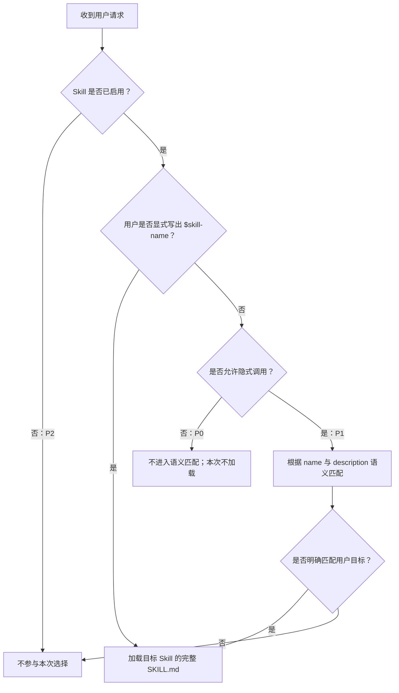

# Skill 调用参与层级与启用策略

## 结论

Codex 没有公开的数字型 skill 优先级字段。Treefolk 使用 P0、P1、P2 作为维护约定，描述一个 skill 是否参与选择，以及它在启用时是否允许隐式匹配，而不是声明它比另一个 skill “更重要”。

- **P0：已启用，仅显式调用。** 用户必须写出 `$skill-name`。适合会提交代码、推送远端、创建仓库或发起 Pull Request 的高影响工作流。
- **P1：已启用，允许隐式匹配。** 用户没有点名 skill 时，Codex 可以根据 `name` 和 `description` 判断是否使用。适合低风险、边界清楚的转换或分析工作流。
- **P2：由 host 配置禁用。** Skill 可以保留在本地并继续由仓库 installer 建立链接，但不参与显式或隐式选择。适合低频、暂时不用或与其他 skill 高度重叠的能力。

P0、P1、P2 不是 Codex 配置字段，也不属于 `treefolk-category`、`treefolk-domain` 或 `treefolk-kind`。这些 `treefolk-*` 值只负责分类，不控制安装或调用。

> **P0 用户须知：** 安装或启用 P0 skill，不代表它会参与基于描述的自动语义匹配。普通自然语言请求不会让模型自动选中它；用户必须输入准确命令。P0 skill 仍可出现在宿主的 skill 列表或命令补全中。当前 Codex adapter 使用 `$repo`、`$push` 和 `$pr`。未来单独实现并验证 Claude Code adapter 后，对应命令将是 `/repo`、`/push` 和 `/pr`；当前 `setup` 尚不支持 Claude Code。

P0 不禁止组合。一个被用户显式调用的 P0 工作流可以组合多个内部步骤，但它必须为完整结果统一承担授权、安全检查、停止条件、验证与报告。它不能依赖基于描述的自动匹配去发现并串联另一个 P0 工作流。

## Codex 如何选择 skill

Codex 选择 skill 时先使用可用 skill 的名称和描述，只在选中 skill 后加载完整的 `SKILL.md`。显式 `$skill-name` 调用最确定；没有显式点名时，只有允许隐式调用的 skill 才进入语义匹配。



这张流程图表达调用与启用关系，不表示多个 P1 skill 之间存在稳定的数值排序。多个描述同时匹配时，不应依赖未公开的选择顺序，而应收紧描述边界或改成 P0。

## 当前分层

| Skill | 层级 | 调用方式 | 原因 |
| --- | --- | --- | --- |
| `repo` | P0 | `$repo` | 会初始化仓库、查询并可能创建托管仓库、创建提交并推送远端 |
| `push` | P0 | `$push` | 会暂存、提交并推送当前任务改动 |
| `pr` | P0 | `$pr` | 会创建分支、提交、推送并创建或复用 Pull Request |
| `to-mmd` | P1 | 显式调用或语义匹配 | 只生成可审阅的 Mermaid 文本；未设置策略时，隐式调用默认为开启 |
| `ui-to-desc` | P1 | 显式调用或语义匹配 | 低风险地整理组件设计证据；只有路径和写入意图明确后才落盘 |

## 配置 P0

在 skill 目录中添加 `agents/openai.yaml`。字符串保持引号，`default_prompt` 必须显式包含该 skill 的 `$name`：

```yaml
interface:
  display_name: "PR"
  short_description: "Safely create and verify pull requests"
  default_prompt: "Use $pr to publish the current work as a verified pull request."

policy:
  allow_implicit_invocation: false
```

在 skill 已启用的前提下，`allow_implicit_invocation: false` 只关闭隐式触发；用户仍然可以显式调用 `$pr`。

## 配置 P2

在 `~/.codex/config.toml` 中按 `SKILL.md` 路径禁用 skill：

```toml
[[skills.config]]
path = "/absolute/path/to/skill/SKILL.md"
enabled = false
```

P2 是 host 层的禁用状态，不是安装过滤器；仓库 `setup` 仍然按目录发现并链接所有顶层 public skill。修改全局配置后重启 Codex。重新启用时将 `enabled` 改为 `true`，或者删除对应配置项。

## 维护原则

1. 把会修改 Git 历史、远端状态或外部系统的工作流默认归为 P0。
2. 仅让高频、低风险且触发边界清楚的工作流保持 P1。
3. 把只适用于单个仓库的 skill 放在仓库级 `.agents/skills`，不要全部安装到全局。
4. 保持 skill 名称唯一。相同名称不会自动合并，也不要依赖目录层级覆盖另一个 skill。
5. 在 `description` 开头写最重要的用户目标和触发词，并说明相邻但不应触发的场景。Skill 很多时，Codex 可能先缩短描述，再从初始列表中省略部分条目。
6. 当两个 P1 skill 经常同时匹配时，优先拆清职责和重写描述；仍有歧义时，把高影响的一方改成 P0。
7. 让仓库 validator 强制检查每个 P0 adapter，拒绝缺失文件、非布尔 `false`，以及未包含准确 `$skill-name` 的默认提示。

Codex 的显式与隐式调用、描述预算、启用配置及 `allow_implicit_invocation` 行为以官方 [Build skills](https://learn.chatgpt.com/docs/build-skills) 文档为准。
