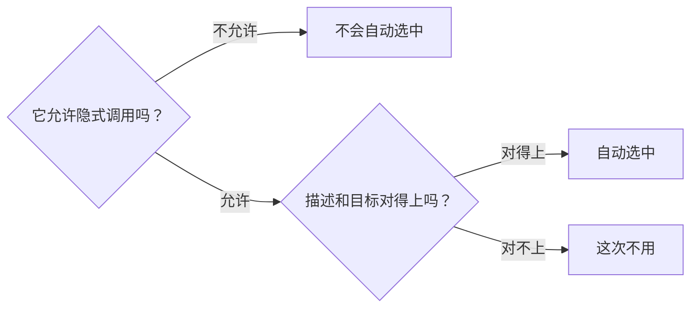

# Skill 调用规则

这份文档回答两个问题：**用 skill 时要不要手写 `$name`？** 和 **不想用某个 skill 时怎么关掉？**

从开头到「关掉某个 skill」是使用说明，再往后是维护者要看的配置和约定。

## 先记住两句话

1. **手写 `$name` 一定生效。** `$push`、`$grill` 这种写法，只要 skill 已安装就会调用它。
2. **不写 `$name` 时，只有一部分 skill 会被自动选中。** 其余的即使描述很贴合，也不会自己跑起来。

这两句话就是两种调用方式的区别：

- **显式调用**：你自己写出 `$name`。任何时候都有效。
- **隐式调用**：你不写名字，Codex 拿 `name` 和 `description` 去匹配，替你决定用哪个。

不写 `$name` 时会发生什么：



隐式调用不是「最像的那个一定赢」。多个 skill 的描述都沾边时，选择顺序没有公开保证；办法是收紧描述，或者把它改成只允许显式调用。

## 全部 skill

**只允许显式调用**——必须手写名字。会提交、推送、建仓库、发 Pull Request、部署这类影响外部结果的流程都在这一组：

| Skill | 用途 |
| --- | --- |
| `$grill` | 逐题盘问一个决定是否值得做，适合「这是伪需求吗」「会不会过度设计」 |
| `$insights` | 回顾最近的 AI 使用记录，给最多三条改进建议并生成本地网页 |
| `$repo` | 首次发布：初始化仓库、找到或创建远端、完成第一次推送 |
| `$push` | 检查、提交并推送本次改动；`$push safe` 做完整核验 |
| `$pr` | 创建分支、提交、推送，并新建或复用 Pull Request |
| `$deploy` | 把选定的源码或产物部署到已有目标并验证；`$deploy plan` 只做本地静态检查 |
| `$loop` | 按验收条件反复迭代一项产物，直到达标或到达执行边界；`$loop help` 只帮你选标准 |

**显式或隐式都行**——可以手写名字，也可能被自动选中。只读、转换，或范围明确且当前请求已经授权的本地工作在这一组：

| Skill | 用途 |
| --- | --- |
| `$build` | 根据明确需求写代码并完成适用验证 |
| `$todo` | 读当前项目的任务文档，推荐一个可审阅的下一步；`$todo adhd` 只是压缩输出 |
| `$human-in-the-loop` | 留下证据、写回验收或取舍反馈，让人看清结果与可信边界 |
| `$to-mmd` | 把流程、架构、时序、数据关系转成 Mermaid 图 |
| `$ui-to-desc` | 把多轮提供的组件设计信息整理成一份可审阅的规格 |
| `$context-shrink` | 在不改行为的前提下，缩小指定源码范围的重复、中转与维护负担 |
| `$seo` | 审查或修复网站、仓库的搜索发现、抓取索引与元信息；`audit` 只读 |
| `$geo` | 核对答案与来源，改善生成式搜索中的准确理解与引用；`audit` 只读 |

只允许显式调用的那一组仍然会出现在宿主的 skill 列表和命令补全里，只是普通自然语言请求不会自动选中它们。

## 关掉某个 skill

编辑 `~/.codex/config.toml`，按 `SKILL.md` 的绝对路径禁用：

```toml
[[skills.config]]
path = "/绝对路径/skills/<name>/SKILL.md"
enabled = false
```

改完重启 Codex。想恢复就把 `false` 改成 `true`，或者删掉这段配置。

关掉的是**选择**，不是安装：`setup` 照样会为它建立链接，文件还在本地，只是 Codex 不再选它，手写 `$name` 也不会调用。

如果配置里写的是旧版源码根目录下的 `SKILL.md`，迁移后要改成对应的 `skills/<name>/SKILL.md`。安装器只迁移能证明归属的链接，不会改写宿主全局配置。

## 维护者：怎么设定调用方式

**只允许显式调用**——在 `skills/<name>/agents/openai.yaml` 里写：

```yaml
interface:
  display_name: "PR"
  short_description: "Safely create and verify pull requests"
  default_prompt: "Use $pr to publish the current work as a verified pull request."

policy:
  allow_implicit_invocation: false
```

`false` 只关掉隐式调用，用户手写 `$name` 仍然有效。

**允许隐式调用**——同一个字段写 `true`，或者整个 `policy` 段落不写（默认允许）。

校验由 `scripts/check-skills.sh` 负责：

- 只有脚本里 `explicit_only_skills` 名单中的 skill 需要 adapter；这份名单要和上表第一组（只允许显式调用）保持一致。
- adapter 必须包含 `interface.display_name`、`interface.short_description` 和 `interface.default_prompt`，其中 `default_prompt` 必须出现准确的 `$name`。
- `policy.allow_implicit_invocation` 必须恰好出现一次、两空格缩进、值是不带引号的 `false`。

被显式调用的 skill 可以把多个步骤组合起来完成一件事，但它要为整个结果统一承担授权、安全检查、停止条件和验证，也不能靠隐式调用去拉起另一个只允许显式调用的 skill。

其余维护约定：

1. 会改 Git 历史、远端状态或外部系统的流程，默认归为只允许显式调用。
2. 只有高频、风险可控、触发边界清楚的才允许隐式调用；涉及本地写入时，当前请求必须已经覆盖该结果，并且有明确范围、停止条件和验证。
3. 只适用于单个仓库的 skill 放仓库级 `.agents/skills`，不要全部装到全局。
4. skill 名称保持唯一。同名不会自动合并，也不要靠目录层级覆盖另一个 skill。
5. `description` 开头写最重要的目标和触发词，并说明相邻但不应触发的场景。skill 很多时，Codex 可能先缩短描述，再从初始列表中省略部分条目。
6. 两个允许隐式调用的 skill 经常同时匹配时，先拆清职责、重写描述；仍有歧义就把高影响的一方改成只允许显式调用。

## 其他约定

`treefolk-category`、`treefolk-domain`、`treefolk-kind` 只负责分类，不控制安装或调用。

调用方式与启用配置以官方 [Build skills](https://learn.chatgpt.com/docs/build-skills) 文档为准。安装位置见 [README](../README.md)，Claude Code 的差异见 [Claude Code 软链说明](../CLAUDE-CODE-LINK.md)。
