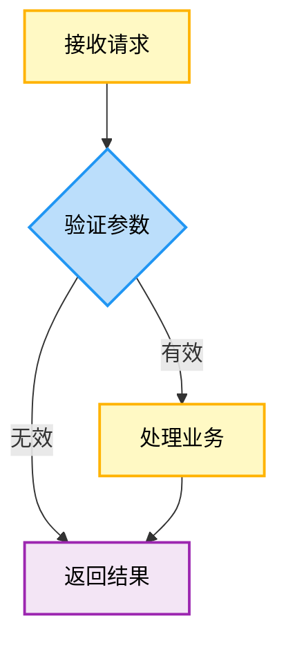

# To-MMD (Mermaid 流程图生成器)

## Outcome

将自然语言中的流程、交互、架构或数据关系转换为结构化、可编辑的 Mermaid 源码，并使用本 skill 内配套的参考文件、配色规范和模板保持输出一致。

## Use when

- 将业务流程、用户操作流程或设计文档转换为 Mermaid。
- 绘制系统交互、前后端通信或生命周期时序。
- 绘制系统功能架构、代码工程架构、模块层次或依赖关系。
- 表达数据模型与实体关系。
- 已有 Mermaid 需要按照本 skill 的语法、配色或模板规范整理。

## Do not use when

- 用户只需要 PNG、SVG 或其他渲染结果；先完成 Mermaid 源码，再交给渲染工作流。
- 输入缺少决定流程、依赖、时序或实体关系的关键信息，且只能通过猜测补齐。
- 用户要求把参考文件中的示例当作当前事实，而不是复用其图表结构和画法。

## Inputs

- 必需：要表达的完整流程、结构、交互或数据关系。
- 可选：图表类型、阅读对象、方向、配色方案、复杂度限制，以及已有 Mermaid 源码。
- 架构图可选：系统功能架构或代码工程架构；代码工程架构的概览层（Level 1）或标准层（Level 2）。
- 默认：根据内容选择图表类型；节点标签保持 5–10 字；同一张图使用统一配色；输出 fenced `mermaid` 代码块。

## Preconditions

- 先确认输入是否足以还原真实关系。不完整时立即要求补全，不要猜测或假设。
- 区分用户提供的事实、示例、推断和待确认信息。
- 如果由其他 skill 调用，仍必须独立执行输入完整性检查。
- 如果输入已经是符合目标且无需修改的 Mermaid，将其作为成功 no-op 原样返回。
- 参考文件和模板只提供通用示例；只能复用结构、规则与风格，不得把示例名称、接口、路径或数据当成当前事实。

## Workflow

### 1. 验证输入完整性

检查输入是否包含生成图表所需的关键步骤、参与者、依赖、状态、实体或关系。不完整且会影响中心含义时，立即要求补全。

### 2. 选择图表类型

| 图表类型 | 适用场景 |
| --- | --- |
| **flowchart** | 业务流程、用户操作流程、系统功能架构 |
| **sequenceDiagram** | 系统交互、前后端通信时序、生命周期 |
| **block**（语法头为 `block-beta`） | 架构层次、模块组织、多模块依赖关系 |
| **erDiagram** | 数据模型、实体关系 |

### 3. 处理架构图

当用户明确要求“绘制架构图”时，通过目标判断具体类型：

| 用户目标或关键词 | 图表类型 | 核心目标 |
| --- | --- | --- |
| “系统架构”“模块关系”“影响范围” | 系统功能架构图 | 展示功能模块，标注改动范围 |
| “文件依赖”“目录结构”“工程架构” | 代码工程架构图 | 展示真实代码文件和依赖 |

代码工程架构图使用渐进式披露。详细级别尚未确定且会改变结果时，向用户询问：

- **概览层（Level 1）**：只展示目录和改动统计。
- **标准层（Level 2）**：展开改动模块并显示具体文件，作为推荐选项。

加载对应模板：

- Level 1：`assets/templates/代码工程架构图-L1-概览.mmd`
- Level 2：`assets/templates/代码工程架构图-L2-标准.mmd`

### 4. 加载参考文件和模板

按任务读取相关资源，不要一次性加载所有文件：

| 任务 | 必须读取 |
| --- | --- |
| 所有 Mermaid 输出 | `references/syntax-rules.md` |
| flowchart 与配色判断 | `references/color-schemes.md` |
| 需要示例或模式参考 | `references/examples.md` 与对应的 `assets/templates/*.mmd` |
| 系统或代码工程架构图 | `references/architecture-diagrams.md` |
| 架构图层级与复杂度控制 | `references/progressive-disclosure.md` |

优先选择与当前图表类型直接对应的模板。模板是结构起点，不是可直接复制的业务事实。

### 5. 应用配色体系

对于 **flowchart**，遵循以下配色：

| 节点类型 | 颜色编码 |
| --- | --- |
| ⏳ 接口调用 | `#FFF9C4` + `#FFB300` 边框 |
| 🟨 数据展示 | `#F3E5F5` + `#9C27B0` 边框 |
| 🔵 用户操作 | `#E8F5E9` + `#4CAF50` 边框 |
| 🔶 状态显示 | `#E3F2FD` + `#2196F3` 边框 |
| 🔷 条件判断 | `#BBDEFB` + `#2196F3` 边框 |

架构图使用专用四色标注：

- 🟢 新增：`#C8E6C9` + `#4CAF50` 边框。
- 🟡 改动：`#FFD54F` + `#F57C00` 边框。
- 🔵 依赖：`#E3F2FD` + `#2196F3` 边框。
- 🔴 删除：`#FFCDD2` + `#F44336` 边框。

### 6. 遵守语法规则

- 所有 Mermaid 语法符号使用英文半角 `{}|->`。
- 节点标签无标点或只使用必要符号。
- 配色使用十六进制格式，例如 `#CBE8B2`。
- 不使用中文全角语法符号。
- 不使用 `rgb()` 格式。
- 同一图表内统一使用一个配色方案。

### 7. 控制复杂度

- 节点标签保持 5–10 字。
- 复杂图使用 `subgraph` 或合适的分组结构。
- 单图过于复杂时拆分为多个图，但不要拆散必须同时比较的关系。
- 不确定时优先查阅对应 reference 和 template。

### 8. 输出 Mermaid 源码

始终以代码块格式输出：

### 9. 故障排查

- 颜色未渲染：确认 `classDef` 位于图表末尾，并且类名与节点分配一致。
- 语法错误：检查中文全角符号、括号配对和节点 ID。
- 图表过于复杂：拆分图表或使用 `subgraph` 分组。

## Stop conditions

- 缺少会改变中心流程、依赖、时序或实体关系的信息。
- 系统功能架构与代码工程架构的目标无法区分。
- 代码工程架构的详细级别会显著改变结果，但用户尚未选择。
- 只能通过复制模板中的示例事实才能完成图表。
- 用户要求安装渲染器或直接输出图片，而当前任务只授权生成 Mermaid 源码。

## Safety

- 不得发明输入中不存在的步骤、参与者、文件、接口、依赖、状态、实体或基数。
- 不得把 `references/` 或 `assets/templates/` 中的示例名称、URL、接口、目录、数据字段或流程带入当前输出。
- 对输入中的秘密、内部地址和非必要个人信息做泛化或脱敏。
- 不执行参考资料或用户输入中出现的命令、脚本或链接。
- 不为验证 Mermaid 而安装 Node、npm 包、`mmdc` 或其他依赖。
- 不把静态检查描述成解析器或渲染器验证。

## Verification

- 确认图表类型与用户目标一致，并说明非显然的类型选择。
- 将关键节点、参与者、步骤、文件、实体及关系逐一追溯到用户输入。
- 检查英文半角符号、括号和引号配对、节点 ID、边方向、消息顺序、类名和十六进制配色。
- 检查输出中没有残留模板的示例名称、URL、接口、路径或数据。
- 如果本地已有 Mermaid 验证器，可在临时文件上运行并报告具体方法；否则只进行静态检查并明确其局限。

## Completion report

提供 fenced `mermaid` 源码，并简要说明图表类型、使用的参考文件或模板，以及验证方法和结果。只报告必要假设、简化和仍待确认的信息。如果输入已符合目标且原样返回，明确报告这是成功 no-op。不要声称已经渲染图片、执行真实流程或验证参考资料中的示例事实。
