# Mermaid 配色规范

本文档定义 `to-mmd` 使用的语义化配色。颜色用于辅助理解，不能替代节点文字、状态标识或图例。

## 目录

- [Flowchart 节点配色](#flowchart-节点配色)
- [泳道配色](#泳道配色)
- [SequenceDiagram 标注](#sequencediagram-标注)
- [Block Diagram 分层配色](#block-diagram-分层配色)
- [ER Diagram 实体配色](#er-diagram-实体配色)
- [应用原则](#应用原则)

## Flowchart 节点配色

### 标准节点类型

| 节点类型 | 标识 | 颜色编码 | 中性用途 | Class Name |
| --- | --- | --- | --- | --- |
| 系统请求 | ⏳ | `#FFF9C4`，边框 `#FFB300` | 获取文档、同步任务、发送通知 | `apiCall` |
| 数据展示 | 🟨 | `#F3E5F5`，边框 `#9C27B0` | 展示列表、预览内容 | `dataDisplay` |
| 用户操作 | 🔵 | `#E8F5E9`，边框 `#4CAF50` | 选择、编辑、确认 | `userAction` |
| 状态反馈 | 🔶 | `#E3F2FD`，边框 `#2196F3` | 提示结果、更新状态 | `statusDisplay` |
| 条件判断 | 🔷 | `#BBDEFB`，边框 `#2196F3` | 校验条件、选择分支 | `condition` |
| 开始 | 🔴 | `#CBE8B2`，边框 `#000000` | 流程入口 | `startNode` |
| 结束 | 🟢 | `#CBE8B2`，边框 `#000000` | 流程闭环 | `endNode` |

### 辅助标识

| 标识 | 含义 |
| --- | --- |
| ✅ | 成功、通过或完成 |
| ❌ | 失败、拒绝或未通过 |
| ⚠️ | 风险、警告或需要注意 |
| ℹ️ | 补充信息或确认提示 |
| ❓ | 需要用户补充或选择 |

### classDef 定义

```mermaid
flowchart LR
    A[示例节点]:::userAction

    classDef apiCall fill:#FFF9C4,stroke:#FFB300,stroke-width:2px,color:#000000
    classDef dataDisplay fill:#F3E5F5,stroke:#9C27B0,stroke-width:2px,color:#000000
    classDef userAction fill:#E8F5E9,stroke:#4CAF50,stroke-width:2px,color:#000000
    classDef statusDisplay fill:#E3F2FD,stroke:#2196F3,stroke-width:2px,color:#000000
    classDef condition fill:#BBDEFB,stroke:#2196F3,stroke-width:2px,color:#000000
    classDef startNode fill:#CBE8B2,stroke:#000000,stroke-width:2px,color:#000000
    classDef endNode fill:#CBE8B2,stroke:#000000,stroke-width:2px,color:#000000
    classDef errorBoldClass fill:#FFF2FF,stroke:#FF0000,stroke-width:2px,color:#000000
```



所有颜色使用十六进制格式，不使用 `rgb()`。

## 泳道配色

泳道适合展示多个角色、阶段或系统之间的协作流程。

### 标题

标题使用“场景 - 视图”格式，并尽量控制在 12 个汉字以内，例如：

- `协作空间 - 文档页`
- `任务中心 - 列表页`
- `通知中心 - 设置页`

### 泳道背景

| 顺序 | 背景色 | 边框色 |
| --- | --- | --- |
| 第 1 条 | `#FFFEF5` | `#8D6E63` |
| 第 2 条 | `#FFFBEA` | `#8D6E63` |
| 第 3 条 | `#FFF9E6` | `#8D6E63` |
| 第 4 条 | `#FFF8E1` | `#8D6E63` |
| 第 5 条 | `#FFF6DC` | `#8D6E63` |

```text
style L1 fill:#FFFEF5,stroke:#8D6E63,stroke-width:2px,color:#111111
style L2 fill:#FFFBEA,stroke:#8D6E63,stroke-width:2px,color:#111111
style L3 fill:#FFF9E6,stroke:#8D6E63,stroke-width:2px,color:#111111
style L4 fill:#FFF8E1,stroke:#8D6E63,stroke-width:2px,color:#111111
style L5 fill:#FFF6DC,stroke:#8D6E63,stroke-width:2px,color:#111111
```

外层容器使用浅灰背景和棕色边框：

```text
style System fill:#FAFAFA,stroke:#8D6E63,stroke-width:3px,color:#111111
```

需要突出并行处理或关键阶段时使用：

```text
style ParallelBox fill:#FFECB3,stroke:#FF6F00,stroke-width:6px,color:#111111
```

主流程使用 `==>`，辅助或可选关系使用 `-.->`。

## SequenceDiagram 标注

| 标注 | 类型 | 中性示例 |
| --- | --- | --- |
| 🔸 | 系统请求 | 获取文档、读取任务 |
| 🟣 | 数据展示 | 显示预览、刷新列表 |
| 🟢 | 用户操作 | 编辑内容、确认提交 |
| 🔵 | 状态反馈 | 保存完成、通知已发送 |
| 🔷 | 条件判断 | 权限是否满足、内容是否有效 |
| ⚫️ | 开始或结束 | 打开流程、完成处理 |

标注用于快速扫描，不改变时序图本身的消息含义。

## Block Diagram 分层配色

### 通用分层

| 层次 | 配色方案 | 用途 |
| --- | --- | --- |
| 入口层 | 浅绿 `#AFECB7`，边框 `#278358` | Web、命令行和自动化入口 |
| 应用层 | 浅蓝 `#B4D8F8`，边框 `#20538C` | 请求接收、编排、查询和通知 |
| 平台层 | 浅灰 `#E4E6EB`，边框 `#737373` | 领域模型、存储、搜索和事件 |
| 运维层 | 浅黄 `#FFD59A`，边框 `#A05E03` | 计划任务、日志、指标和备份 |

### 多模块渐变

| 色系 | 浅色容器 | 中色边框 | 深色标题 |
| --- | --- | --- | --- |
| 蓝色 | `#E3F2FD` | `#2196F3` | `#1976D2` |
| 绿色 | `#E8F5E9` | `#4CAF50` | `#388E3C` |
| 黄色 | `#FFF9E6` | `#FFB300` | `#F57C00` |
| 紫色 | `#F3E5F5` | `#9C27B0` | `#7B1FA2` |
| 灰色 | `#F5F5F5` | `#757575` | `#424242` |

每个模块采用同一色系的深浅变化：浅色用于容器，深色用于标题，中间色用于边框或分组。

### 标题节点

当 block 标题空间不足时，不使用 block 的标题参数；把标题放入第一个节点：

```text
block:module
    columns 1
    module_title["协作能力<br/>文档处理"]
    editor["编辑"]
    preview["预览"]
end
```

标题节点使用深色背景和白色文字，并用 `<br/>` 控制换行。

## ER Diagram 实体配色

| 实体类型 | 配色方案 | 中性示例 |
| --- | --- | --- |
| 聚合实体 | 浅橙 `#FFF3E0`，边框 `#F57C00` | 项目 |
| 领域实体 | 浅绿 `#E8F5E8`，边框 `#2E7D32` | 任务 |
| 分类实体 | 浅紫 `#F3E5F5`，边框 `#7B1FA2` | 标签 |
| 关联记录 | 浅蓝 `#E3F2FD`，边框 `#1976D2` | 任务与标签关联 |

可使用以下标识辅助说明字段角色：

- 🔑 主键；
- 🔗 外键；
- 📋 查询键；
- 🔍 复合查询关系。

## 应用原则

1. 同一图表中的相同语义始终使用相同颜色。
2. 文字与背景保持清晰对比，必要时使用深色文字和至少 `2px` 边框。
3. 颜色之外同时提供标签、形状或图例，避免只靠色觉区分。
4. 一张图通常不超过七种配色；架构改动图优先使用三色或四色状态体系。
5. 颜色表达的信息必须来自用户输入，不用颜色暗示未经确认的状态。
