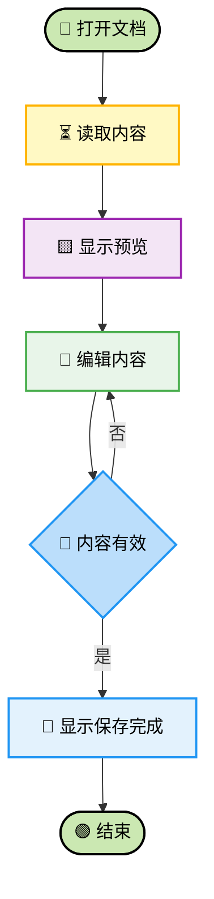

# Mermaid 模板索引与中性示例

本文档说明 `assets/templates/` 中各模板的用途和复用方式。所有场景、角色和名称均为虚构示例。

## 目录

- [模板索引](#模板索引)
- [选择方法](#选择方法)
- [模板特性](#模板特性)
- [快速开始](#快速开始)
- [使用边界](#使用边界)

## 模板索引

### Flowchart

| 模板文件 | 类型 | 中性场景 | 关键特性 |
| --- | --- | --- | --- |
| `flowchart-swimlane.mmd` | 泳道流程图 | 文档从创建到通知的协作流程 | 多泳道、主流程、并行处理 |
| `flowchart-complex.mmd` | 复杂流程图 | 数据导入与校验 | 分组、回退、确认、写入分支 |
| `flowchart-user-flow.mmd` | 用户流程图 | 创建并提交反馈 | 创建方式、校验、预览、重试 |

### SequenceDiagram

| 模板文件 | 类型 | 中性场景 | 关键特性 |
| --- | --- | --- | --- |
| `sequencediagram-basic.mmd` | 基础时序图 | 文件上传与保存 | 三方交互、校验、结果分支 |
| `sequencediagram-advanced.mmd` | 高级时序图 | 异步生成报告 | 自动编号、缓存、队列、轮询 |
| `sequencediagram-lifecycle.mmd` | 生命周期时序图 | 定时备份与清理 | 配置、执行、校验、保留策略 |

### Block Diagram

| 模板文件 | 类型 | 中性场景 | 关键特性 |
| --- | --- | --- | --- |
| `block-architecture-layered.mmd` | 多模块架构图 | 输入、协调和输出模块 | 横向模块、深色标题、分组容器 |
| `block-architecture.mmd` | 分层架构图 | 通用服务分层 | 入口、应用、平台、运维层 |

### ER Diagram

| 模板文件 | 类型 | 中性场景 | 关键特性 |
| --- | --- | --- | --- |
| `erdiagram-database.mmd` | 实体关系图 | 项目、任务和标签 | 关联实体、字段角色、类型配色 |

### 架构图

| 模板文件 | 详细程度 | 用途 |
| --- | --- | --- |
| `系统功能架构图.mmd` | 功能级 | 展示能力关系和改动范围 |
| `代码工程架构图-L1-概览.mmd` | Level 1 | 展示目录和改动统计 |
| `代码工程架构图-L2-标准.mmd` | Level 2 | 展开改动文件并精简依赖 |

## 选择方法

1. 先确定要表达的是流程、交互顺序、系统组成、数据关系还是代码改动。
2. 选择最接近的模板，只复用结构和样式。
3. 使用当前输入中的事实替换全部占位内容。
4. 删除与目标无关的节点、分支、参与者和实体。
5. 按 `syntax-rules.md` 检查语法，按 `color-schemes.md` 检查配色。

常用映射：

- 多角色或多阶段协作 → `flowchart-swimlane.mmd`
- 带校验、回退和写入处理的流程 → `flowchart-complex.mmd`
- 清晰的用户操作路径 → `flowchart-user-flow.mmd`
- 参与者之间的消息顺序 → `sequencediagram-basic.mmd`
- 包含可选步骤和多分支的交互 → `sequencediagram-advanced.mmd`
- 分层系统组成 → `block-architecture.mmd`
- 多模块横向关系 → `block-architecture-layered.mmd`
- 实体和字段关系 → `erdiagram-database.mmd`

## 模板特性

### flowchart-swimlane.mmd

- 使用多个 `subgraph` 划分角色或阶段；
- 浅黄色渐变背景和棕色边框区分泳道；
- `==>` 突出主流程，`-.->` 表示辅助关系；
- 高亮容器适合表达并行处理或关键阶段。

中性替换方向：内容创建、自动检查、人工确认、结果发布和完成归档。

### flowchart-complex.mmd

- 使用分组组织输入、校验、确认和写入阶段；
- 使用 `classDef` 表达操作、展示、状态和条件；
- 支持格式错误、数据修正、回滚和结果摘要。

中性替换方向：导入数据、检查规则、预览结果、确认写入和失败回滚。

### flowchart-user-flow.mmd

- 强调用户从输入到结果反馈的连续路径；
- 支持条件判断和多个验证分支；
- 适合控制在 10 至 15 个主要节点。

中性替换方向：选择创建方式、填写反馈、检查必填项、预览并提交。

### sequencediagram-basic.mmd

- 适合三个左右的参与者；
- 使用 `alt` 表达成功和失败；
- 使用注释划分读取、编辑和提交阶段。

中性参与者可以是“用户”“上传界面”“文件存储”。

### sequencediagram-advanced.mmd

- 使用 `autonumber` 自动编号；
- 使用 `opt`、`alt` 和 `Note` 表达可选步骤与分支；
- 适合展示缓存命中、异步任务、生成结果和状态轮询。

仅保留当前输入明确涉及的参与者，不因模板存在而补造系统。

### sequencediagram-lifecycle.mmd

- 按阶段展示计划从配置到执行结束的变化；
- 适合同时表达成功、失败、校验和清理分支；
- 阶段名称应来自用户描述，而不是模板占位词。

### block-architecture-layered.mmd

- 多模块横向布局；
- 同一模块使用同色系渐变；
- 第一个深色节点承载完整标题，避免标题被挤压；
- 分组容器用于展示模块内部结构。

标题节点写法：

```text
block:module
    columns 1
    module_title["文档能力<br/>编辑与预览"]
```

### block-architecture.mmd

- 垂直展示入口、应用、平台和运维层；
- 使用 `columns` 控制每层的节点排列；
- 连线只表达输入中已确认的依赖或数据流向。

### erdiagram-database.mmd

- 使用核心、关联和记录实体配色；
- 支持一对一、一对多和多对多关系；
- 字段角色可使用主键、外键和查询键标识；
- 不添加输入中不存在的字段、约束或索引。

### 系统与代码架构模板

- 系统功能架构图使用黄、蓝、绿标注修改、保留和依赖；
- Level 1 只展示目录和统计；
- Level 2 只展开改动文件，未改动依赖保持折叠；
- 详细规则见 `architecture-diagrams.md` 和 `progressive-disclosure.md`。

## 快速开始

下面的虚构示例演示“编辑文档并收到保存结果”的最小流程：



## 使用边界

- 模板只提供结构和样式，不代表当前系统事实；
- 不保留模板中的占位名称、关系、字段或路径；
- 不把示例中的参与者当成用户系统的真实组件；
- 缺少关键信息时应向用户询问，或在结果中明确标记假设；
- 输出前检查是否残留与当前任务无关的名称、地址、路径和业务关系。
