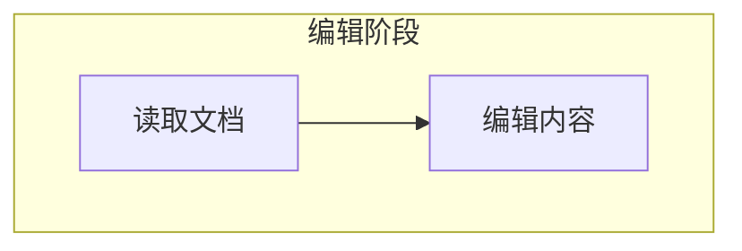
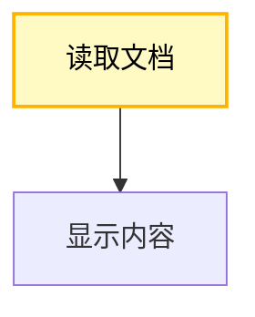

# Mermaid 语法规则与检查指南

本文档汇总容易影响 Mermaid 解析和可读性的规则。示例使用虚构的文档、任务和通知场景。

## 目录

- [必须遵守的规则](#必须遵守的规则)
- [常见错误](#常见错误)
- [节点形状](#节点形状)
- [可读性原则](#可读性原则)
- [检查清单](#检查清单)

## 必须遵守的规则

### 1. 使用英文半角语法符号

Mermaid 语法符号必须使用英文半角字符。

| 符号类型 | 正确 | 错误 |
| --- | --- | --- |
| 花括号 | `{}` | `｛｝` |
| 方括号 | `[]` | `［］` |
| 圆括号 | `()` | `（）` |
| 箭头 | `-->` | `－－＞` |
| 竖线 | `|` | `｜` |

```text
A{内容有效} -->|是| B[保存文档]
```

中文可以出现在标签中，但不能替代 Mermaid 的结构符号。

### 2. 保持节点标签简洁

节点标签优先使用动作加对象，例如：

- `读取文档`
- `检查内容`
- `发送通知`

避免在标签末尾添加句号、问号等不必要的标点。较长说明使用 `Note`、注释或相邻说明节点。

### 3. 使用十六进制颜色

```text
classDef apiCall fill:#FFF9C4,stroke:#FFB300,stroke-width:2px,color:#000000
```

不要使用 `rgb()`，以保持模板风格一致。

### 4. 节点 ID 必须唯一

```text
A[打开文档]
B[编辑内容]
C[保存完成]
```

节点 ID 可以使用简短字母或有意义的驼峰名称，如 `loadDocument`。避免数字开头，也不要复用同一 ID 表示不同节点。

### 5. 正确选择连接线

| 语法 | 含义 |
| --- | --- |
| `A --> B` | 普通方向关系 |
| `A -.-> B` | 可选、辅助或依赖关系 |
| `A ==> B` | 需要强调的主流程 |
| `A --- B` | 无方向关联 |

条件标签放在半角竖线之间：

```text
Valid -->|是| Save
Valid -->|否| Edit
```

### 6. 正确组织 subgraph



- 节点定义在所属子图内部；
- 子图 ID 使用英文或数字组合，标题可以使用中文；
- 使用 `direction TB` 或 `direction LR` 控制子图内部方向；
- 嵌套层次以表达必要结构为限。

### 7. 使用图表类型支持的语法

- `flowchart` 用于步骤、判断和依赖；
- `sequenceDiagram` 用于参与者之间的消息顺序；
- `block-beta` 用于分层或模块组成；
- `erDiagram` 用于实体关系。

不要把一种图表的专用语法直接放入另一种图表。

## 常见错误

### 颜色未生效

确认节点已绑定 class，并把 `classDef` 放在主体定义之后：



### 图表无法解析

按顺序检查：

1. 是否混入全角括号、箭头或竖线；
2. 括号和引号是否配对；
3. 节点 ID 是否重复；
4. 箭头和条件标签是否完整；
5. 当前 Mermaid 渲染环境是否支持所用图表类型。

### 图表过于复杂

- 使用 `subgraph` 按阶段或职责分组；
- 保留 10 至 15 个主要节点；
- 把相对独立的支线拆成另一张图；
- 对代码工程架构图使用 Level 1 或 Level 2 渐进披露。

### 关系含义不清

- 为条件分支添加“是”“否”或具体条件；
- 用虚线表达可选或依赖关系；
- 用粗箭头只强调一条主要路径；
- 不添加输入中没有说明的方向或依赖。

## 节点形状

| 语法 | 形状 | 建议用途 |
| --- | --- | --- |
| `A[文本]` | 矩形 | 普通步骤或能力 |
| `A{文本}` | 菱形 | 条件判断 |
| `A(文本)` | 圆角矩形 | 流程边界或状态 |
| `A((文本))` | 圆形 | 需要强调的节点 |

形状表达语义，不要仅为装饰而混用。

## 可读性原则

1. 节点标签通常保持在 5 至 10 个汉字。
2. 同一张图使用统一的命名视角，例如全部使用动作短语或能力名词。
3. 相同语义使用同一配色，具体定义见 `color-schemes.md`。
4. 超过八个节点时评估是否需要分组，但不要为了分组增加无意义层级。
5. 长流程不必机械添加“开始”和“结束”；只有它们能明确边界时才添加。
6. 模板中的节点、关系和标签只是占位内容，输出前必须全部替换或删除。

## 检查清单

- [ ] 所有结构符号使用英文半角；
- [ ] 括号、引号和条件竖线完整配对；
- [ ] 节点 ID 唯一且不以数字开头；
- [ ] 节点标签简短，没有不必要的标点；
- [ ] 颜色使用十六进制格式；
- [ ] class 已绑定到正确节点；
- [ ] 分支条件和连接方向清楚；
- [ ] 图表类型与所用语法匹配；
- [ ] 示例占位内容和无关信息已移除；
- [ ] Mermaid 源码能够独立解析。
